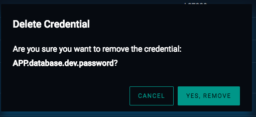

# Deleting Credentials

Users with proper permissions can remove a credential entirely from the DynamoDB table. To do this, click the vertical
three dots to the right of a credential in the credential table and select `Delete`. A confirmation dialog will appear
asking you to confirm the delete. Selecting `Yes, Remove` will perform the deletion, with a small pop-up appearing at
the bottom of the screen once the delete has completed.

_Note: This action will remove_ __ALL__ _entries of a credential from the DynamoDB table, not just the most recent edit.
The_ `Delete` _operation should not be performed unless there is no longer a need for the credential._

