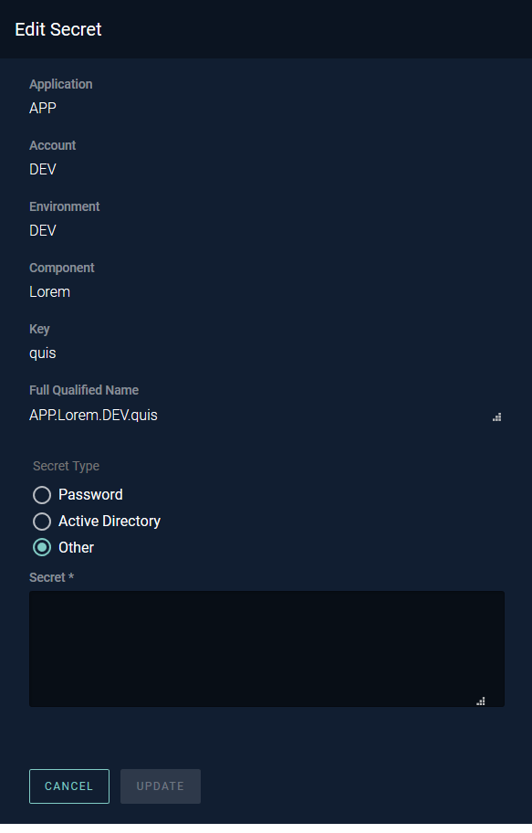

# Editing Credentials

Users with the proper permissions can modify credentials through the Edit Credentials sidebar. This can be accessed by
clicking the vertical three dots to the right of a credential in the credentials table and selecting `Edit`.

To modify a credential's secret, simply enter the new secret into the textbox in the Secret section. If the secret is a
special kind of secret, such as an Active Directory password, click the respective radio button above the Secret
section. Fidelius will then automatically check the format of the entered secret to make sure it is correct. Click the
`Update` button to save the edit.

