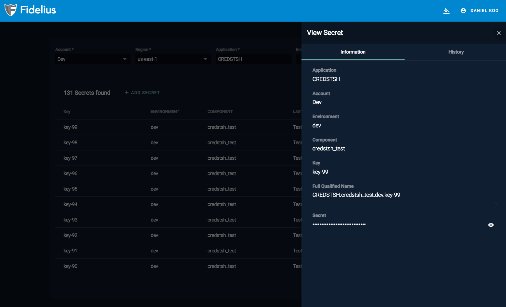

# Fidelius AWS Secrets Manager

## Overview
Fidelius Secrets Manager is an online application used for securely storing and accessing secrets using AWS DynamoDB
tables. Fidelius aims to provide organizations with an easy-to-use, secure, and organized way to create, view, modify,
collections of encrypted secrets as well as provide a system for managing user and application access to those secrets.

Fidelius uses configurable LDAP through Open Directory or Active Directory to set permissions for users to access secrets.
Fidelius provides an [angular application](UI/ui_setup_local.md), a [Java SDK package](SDK/sdk_quickstart.md), and a backend service to set and retrieve secrets across
multiple environments.

## Quick Start
Check out [QuickStart for Linux/Mac](QuickStart.md) or [QuickStart for Windows](QuickStartWindows.md) to get started!

